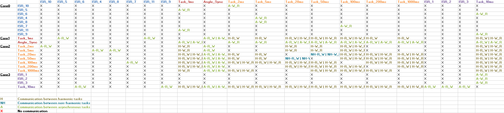

The challenge consists in the analysis of a powertrain application that runs in a multi-core embedded platform. The application information is abstracted and represented through the AMALTHEA model. AMALTHEA is an open source platform for the modeling of embedded multi/many core systems. The AMALTHEA model contains the hardware description, constraints and software requirements. The model follows the same hardware and software specification of the 2016 model challenge [2], but with different inter-task communication semantics, namely, implicit communication and Logical Execution Time (LET). Specifically, the addressed challenges are: 
1) propose and demonstrate how implicit and LET communication may be realized, e.g., by adding additional runnables and/or tasks performing copy operations. 
2) compute the overheads in terms of extra cycles used for memory access and also in terms of extra memory required due to the proposed implementation. 
3) compute end-to-end latencies (age/reaction latency) of the event chains (best, average and worst case). The solution should be able to handle multi-rate effect chains consisting of tasks with harmonic and non-harmonic periods. 
4) propose a different label mapping that could possibly reduce the memory access overheads. 5) factor in the effects of contention on the interconnect in the memory access overhead and show the impacts on end-to-end latencies.
The description of this work is depicted in the file 'FMTV_WATERS_2017.pdf'.

Then is presented some information abstracted from the AMALTHEA model.

## [AMALTHEA model data]

  

  

<table style="width:100%">
  <tr>
    <th>
      

           
            
      

    </th>
    <th>
      

           
            
      

    </th>

  </tr>
</table>

## [Effect chains] src/waters/[LETCommunication/ImplicitCommunication/ExplicitCommunication]

           

 

           
 

